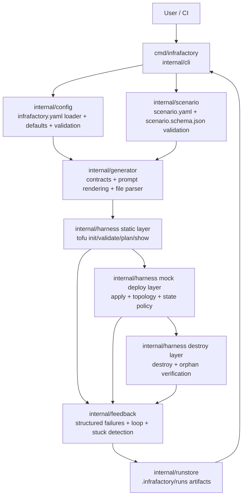

# InfraFactory

Scenario-driven infrastructure generation and validation for Scaleway with OpenTofu.

## Problem It Solves

Teams often face the same infrastructure pain points:
- Infrastructure intent is documented in prose, but implementation is in hand-written IaC.
- Validation is inconsistent and manual (or only static linting).
- Failed iterations are hard to diagnose and repeat.

InfraFactory addresses this by making infrastructure delivery scenario-driven and deterministic:
1. Define intent in scenario YAML.
2. Validate contracts up front (config + schema).
3. Generate and validate infrastructure through layered checks.
4. Persist artifacts and structured failures for repeatable iteration.

## Architecture



High-level flow:
1. Validate config and scenario contracts.
2. Generate OpenTofu files from scenario intent.
3. Run static checks (`tofu init/validate/plan/show`).
4. Run deploy-layer checks (apply, topology, state policy).
5. Run destroy and orphan verification.
6. Persist run artifacts and iterate based on structured feedback.

## Current State

Core internal slices are implemented and tested:
- Config loading and validation (`internal/config`)
- Scenario parsing and JSON Schema validation (`internal/scenario`)
- Generator contracts, prompt rendering, and `# File:` parsing (`internal/generator`)
- Static, mock-deploy, and destroy harness primitives (`internal/harness`)
- Feedback loop and stuck detection helpers (`internal/feedback`)
- Filesystem run store (`internal/runstore`)

CLI commands are wired (`init`, `generate`, `validate`, `test`, `run`, `mock start`), while end-to-end command orchestration is still being integrated.

## Repository Layout

- `cmd/infrafactory/`: CLI entrypoint
- `internal/cli`: command tree and command-level wiring
- `internal/config`: runtime config model and loader (`infrafactory.yaml`)
- `internal/scenario`: scenario parsing and schema validation
- `internal/generator`: generator contracts, prompt rendering, output parser
- `internal/harness`: static/deploy/destroy orchestration primitives
- `internal/feedback`: failure models, loop control, stuck detection
- `internal/runstore`: `.infrafactory/runs` persistence implementation
- `scenario.schema.json`: scenario contract
- `infrafactory.yaml`: runtime config contract
- `policies/`: OPA policy files
- `scenarios/`: training/holdout/regression fixtures

## Requirements

- Go `1.24+`
- OpenTofu (`tofu`) available in `PATH`
- Optional for deploy-layer integration: Mockway running locally

## Quick Start

```bash
go mod tidy
go test ./...
go run ./cmd/infrafactory --help
```

## Usage

### Basic setup and verification

```bash
go mod tidy
go test ./...
bash scripts/check_all.sh
```

### Practical example 1: Inspect available CLI commands

```bash
go run ./cmd/infrafactory --help
```

Command tree currently exposed:
- `init`
- `generate`
- `validate`
- `test`
- `run`
- `mock start`

### Practical example 2: Work with scenario and config contracts

Use these files as your canonical inputs:
- Runtime config: `infrafactory.yaml`
- Scenario schema: `scenario.schema.json`
- Training scenario example: `scenarios/training/web-app-paris.yaml`
- Holdout scenario example: `scenarios/holdout/web-app-paris-pinned.yaml`

### Practical example 3: Run package-focused checks while developing

```bash
go test ./internal/config
go test ./internal/scenario
go test ./internal/generator
go test ./internal/harness
go test ./internal/feedback
go test ./internal/runstore
```

### Practical example 4: Run optional layer-2 integration smoke test

```bash
INFRAFACTORY_ENABLE_INTEGRATION=1 \
INFRAFACTORY_MOCKWAY_URL=http://localhost:8080 \
go test ./internal/harness -run TestLayer2IntegrationSmoke
```

### Practical example 5: Inspect persisted run artifacts

```text
.infrafactory/runs/<scenario>/<run-id>/
```

You will find run metadata and per-iteration artifacts in that directory tree.

## Local Quality Checks

```bash
bash scripts/check_all.sh
```

## Documentation Index

- Architecture: `docs/architecture.md`
- Full concept log: `CONCEPT.md`
- Decisions (ADRs): `docs/decisions/`
- Contributor guide: `CONTRIBUTING.md`
- Agent workflow: `AGENTS.md`
- Session bootstrap: `SESSION_START.md`
- Ticket backlog: `BACKLOG.md`
- Current execution stub: `CURRENT_TICKET.md`
- Rolling status: `STATUS.md`
- Execution prompt: `docs/process/EXECUTION_PROMPT.md`

## Agent Kickoff

For autonomous ticket execution in a fresh agent session, use:

```text
Use docs/process/EXECUTION_PROMPT.md exactly. Start now.
```

## License

Apache License 2.0. See `LICENSE`.
