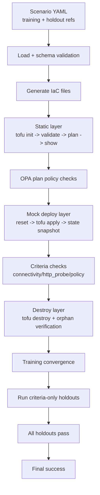
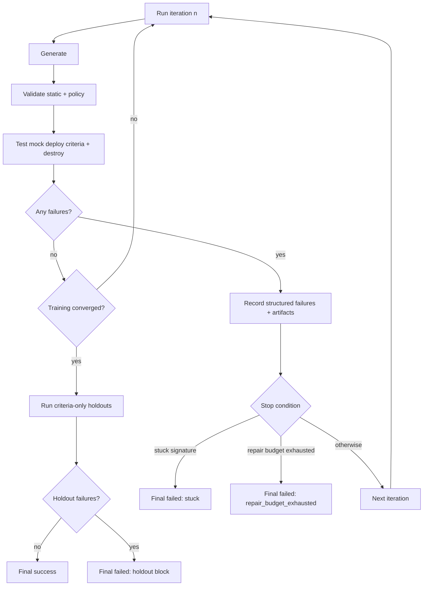

# InfraFactory

Scenario-driven infrastructure generation and validation for Scaleway with OpenTofu.

## Problem It Solves

Teams often face the same infrastructure pain points:
- Infrastructure intent is documented in prose, but implementation is in hand-written IaC.
- Validation is inconsistent and manual (or only static linting).
- Failed iterations are hard to diagnose and repeat.

InfraFactory addresses this by making infrastructure delivery scenario-driven and deterministic:
1. Define intent in scenario YAML.
2. Validate contracts up front (config + schema).
3. Generate and validate infrastructure through layered checks.
4. Persist artifacts and structured failures for repeatable iteration.

## New Here

If you are onboarding to this repo, use this order:
1. Run `go run ./cmd/infrafactory --help` once to see the command contract.
2. Read `internal/cli/root.go` to see command entrypoints.
3. Read `internal/cli/runtime.go` to understand shared runtime setup and dependency injection.
4. Read one command end-to-end (`internal/cli/generate_command.go`), then compare with `validate`, `test`, and `run`.
5. Read package contracts in this order: `internal/config`, `internal/scenario`, `internal/generator`, `internal/harness`, `internal/feedback`, `internal/runstore`.

First 10-minute code walk:
1. `go test ./internal/cli -run TestGenerateCommandWritesFilesDeterministically`
2. `go test ./internal/scenario -run TestLoadWithSchemaPaths`
3. `go test ./internal/harness -run TestStaticHarness`

This gives one quick pass across command orchestration, input contracts, and harness execution.

## Mental Model

Think in three layers:
1. Contracts: config/scenario parsing and validation up front.
2. Execution primitives: generator/harness packages return deterministic typed results.
3. Orchestration: CLI commands compose primitives and map errors/output to a stable CLI contract.

Single-command lifecycle (`generate`, simplified):
1. `internal/cli` builds runtime (config + dependencies + loaders).
2. Scenario is loaded and validated (`internal/scenario` + `scenario.schema.json`).
3. Generator returns files as data (`internal/generator`), not filesystem side effects.
4. CLI writes files deterministically and renders command output.

## Architecture


High-level flow:
1. Validate config and scenario contracts.
2. Generate OpenTofu files from scenario intent.
3. Run static checks (`tofu init/validate/plan/show`).
4. Run deploy-layer checks (apply, topology, state policy).
5. Run destroy and orphan verification.
6. Persist run artifacts and iterate based on structured feedback.

## Process Flows

Note: static validation currently uses `tofu init/validate/plan/show` plus OPA policy checks; `tflint` is not part of the wired default pipeline.

Happy path (training + holdouts):



Failure and retry loop path:



## Validation Layers

1. Layer 1: Static
- Purpose: catch invalid IaC and policy violations early, before any deploy action.
- Runs `tofu init`, `tofu validate`, `tofu plan -out=tfplan`, `tofu show -json tfplan`
- Evaluates OPA policy checks on plan JSON (`deny`)

2. Layer 2: Mock Deploy (Mockway-backed)
- Purpose: verify deploy-time behavior and topology/policy expectations in a deterministic, low-cost environment.
- Resets mock state via mock client (`POST /mock/reset`)
- Runs `tofu apply -auto-approve`
- Pulls mock state snapshot (`GET /mock/state`)
- Runs topology checks on mock state
- Evaluates OPA state policies on mock state (`deny_state`)

3. Layer 3: Destroy Verification
- Purpose: ensure cleanup behavior is correct and no resources are left behind.
- Runs `tofu destroy -auto-approve`
- Pulls mock state snapshot and verifies no orphan resources remain

Supporting control loop:
- `run` command loop with dual controls (`repair_iterations_max`, `iterations_target`)
- Stuck detection via failure-signature subset logic
- Run/iteration artifact persistence under `.infrafactory/runs/...`

### OPA Plan Policy Checks (Static Layer)

OPA plan checks run during static validation and are evaluated against `tofu show -json tfplan` output.
These checks use Rego `deny` rules from configured policy paths and fail validation before deploy-layer execution when violations are found.

Representative policy files:
- `policies/scaleway/no_public_database.rego`
- `policies/scaleway/no_public_endpoints.rego`
- `policies/scaleway/vpc_required.rego`
- `policies/scaleway/region_restriction.rego`
- `policies/common/naming.rego`

This is separate from holdouts:
- OPA plan checks are part of the training/static validation stage within each run iteration.
- Holdouts are criteria-only scenarios executed after training convergence as a final gating phase.

## Current State

Core internal slices are implemented and tested:
- Config loading and validation (`internal/config`)
- Scenario parsing and JSON Schema validation (`internal/scenario`)
- Generator contracts, prompt rendering, and `# File:` parsing (`internal/generator`)
- Static, mock-deploy, and destroy harness primitives (`internal/harness`)
- Failure-signature and stuck detection helpers (`internal/feedback`)
- Filesystem run store (`internal/runstore`)

CLI command orchestration is now wired for:
- `init` scaffold generation
- `generate` pipeline adapter (runtime + scenario + generator write path)
- `validate` static harness + policy reporting
- `test` mock deploy + destroy verification flow
- `run` criteria-aware multi-iteration orchestration with convergence controls, holdout gating, and runstore persistence
- `mock` lifecycle wrappers (`start`/`stop`/`status`/`logs`)

Feature status snapshot:

| Area | Status | Notes |
|---|---|---|
| `init` scaffold | implemented | Writes deterministic schema-valid starter file. |
| `generate` runtime path | implemented with concrete transports | Runtime selects `claude-code` or `openrouter` adapters from config. |
| `validate` static layer | implemented | Runs `tofu init/validate/plan/show` + plan policy evaluation. |
| `test` mock deploy + destroy | implemented | Runs mock reset/apply/state checks and destruction verification flow. |
| `run` orchestration | implemented | Criteria-aware convergence and criteria-only holdout completion checks are wired. |
| `mock` command lifecycle | implemented | `mock start`/`stop`/`status`/`logs` are wired with deterministic output/error behavior. |
| sandbox/live deploy | permanently blocked | Governed as a permanent non-goal (ADR-0003). |

Next hardening slice:
- Slice 16 is dedicated to remediating unresolved robustness issues tracked in `ISSUES.md` (context cancellation propagation, bounded external reads, deterministic env overrides, schema-validation availability guarantees, and policy correctness cleanups).
- Ticket execution order is tracked in `BACKLOG.md` (`S16-T1`..`S16-T8`).

Notes on current runtime prerequisites:
- `generate` and `run` resolve a concrete transport-backed `SeedGenerator` from runtime (`internal/cli/runtime.go`) when no test/injected generator is provided.
- Runtime wiring path: `buildRuntime(...)` selects `NewClaudeSeedGenerator(...)` for `agent.type=claude-code` and `NewOpenRouterSeedGenerator(...)` for `agent.type=openrouter`.
- `openrouter` runtime path requires `OPENROUTER_API_KEY` at execution time; missing key surfaces deterministic `dependency_unavailable` failure output.
- `validate`/`test`/`run` expect generated OpenTofu files and tool/runtime dependencies (`tofu`, Mockway, and Docker for `mock` lifecycle commands).
- Sandbox/live deploy layer (real Scaleway) is permanently disabled by governance policy (see `docs/decisions/0003-permanent-sandbox-live-deploy-block.md`).

### Deferred and Non-Goals

The following are known non-goals and are intentionally not complete:
- Sandbox/live deploy (real Scaleway) is permanently blocked and out-of-scope under ADR-0003.

Criteria support status:
- `connectivity`: criteria-driven topology checks are wired and propagated through `test` and `run` convergence.
- `http_probe`: criteria-driven topology checks are wired and propagated through `test` and `run` convergence.
- `policy`: criteria-driven state-policy checks are wired and propagated through `test` and `run` convergence.
- `destruction`: supported as lifecycle stage and holdout-completion gating behavior in `run`.
- `dns_resolution`: sandbox/live-only behavior; currently auto-passes with explicit informational output in `criteria/support_matrix` because there is no real cloud-provider validation path.
  Output includes explicit messaging: `currently automatically passes due to lack of real world cloud provider (real deployment skipped for cost reasons for now)`.

## Repository Layout

- `cmd/infrafactory/`: CLI entrypoint
- `internal/cli`: command tree and command-level wiring
- `internal/config`: runtime config model and loader (`infrafactory.yaml`)
- `internal/scenario`: scenario parsing and schema validation
- `internal/generator`: generator contracts, prompt rendering, output parser
- `internal/harness`: static/deploy/destroy orchestration primitives
- `internal/feedback`: failure models and stuck-detection helpers
- `internal/runstore`: `.infrafactory/runs` persistence implementation
- `scenario.schema.json`: scenario contract
- `infrafactory.yaml`: runtime config contract
- `policies/`: OPA policy files
- `scenarios/`: training/holdout/regression fixtures

Package ownership guide:
- `internal/cli`: args/flags, runtime wiring, command orchestration, output contract.
- `internal/config`: `infrafactory.yaml` defaults + typed validation errors.
- `internal/scenario`: scenario decode + schema validation + typed model.
- `internal/generator`: generator interfaces/errors, prompt rendering, output parsing.
- `internal/harness`: static/mock/destroy workflows and stage-level failures.
- `internal/feedback`: failure-signature modeling and stuck-detection utilities.
- `internal/runstore`: persisted run metadata and iteration artifacts.

## Requirements

- Go `1.24.6+`
- OpenTofu (`tofu`) available in `PATH`
- Docker + Docker Compose plugin (`docker compose`)
- `make`
- `curl` (used by smoke/dependency readiness helpers)
- Optional for deploy-layer integration: Mockway running locally

## Quick Start

```bash
go mod tidy
go test ./...
go run ./cmd/infrafactory --help
```

Important:
- For `agent.type=claude-code`, ensure `agent.claude.command` is installed and available in `PATH` (default: `claude`).
- For `agent.type=openrouter`, set `OPENROUTER_API_KEY` and configure `agent.openrouter.model`.

## Happy Path (Claude Code)

Run these commands from this repository root.

1. Start dependencies (Mockway).
```bash
make deps-up
```

2. Verify prerequisites.
```bash
tofu version
go run ./cmd/infrafactory --help
claude --version
```

3. Configure `infrafactory.yaml` for Claude transport:
- `agent.type: claude-code`
- `agent.claude.command: claude` (or full binary path)
- ensure the `claude` CLI is authenticated in your shell session

4. Run the full flow:
```bash
go run ./cmd/infrafactory generate scenarios/training/web-app-paris.yaml --config infrafactory.yaml --output human
go run ./cmd/infrafactory validate scenarios/training/web-app-paris.yaml --config infrafactory.yaml --output human
go run ./cmd/infrafactory test scenarios/training/web-app-paris.yaml --config infrafactory.yaml --output human
go run ./cmd/infrafactory run scenarios/training/web-app-paris.yaml --config infrafactory.yaml --repair-iterations-max 3 --iterations-target 3 --output human
```

5. Confirm artifacts:
- generated Terraform: `output/web-app-paris/`
- run artifacts: `.infrafactory/runs/web-app-paris/<run-id>/`

6. Cleanup:
```bash
make deps-down
```

## End-to-End Walkthrough

This is the shortest realistic path for a new contributor:

1. Create a scenario scaffold.
```bash
go run ./cmd/infrafactory init --path scenarios/training/new-scenario.yaml
```
2. Edit `scenarios/training/new-scenario.yaml` with real resources/criteria.
3. Generate files.
```bash
go run ./cmd/infrafactory generate scenarios/training/new-scenario.yaml --config infrafactory.yaml --output human
```
4. Validate static checks.
```bash
go run ./cmd/infrafactory validate scenarios/training/new-scenario.yaml --config infrafactory.yaml --output human
```
5. Run full orchestration loop.
```bash
go run ./cmd/infrafactory run scenarios/training/new-scenario.yaml --config infrafactory.yaml --repair-iterations-max 3 --iterations-target 3 --output json
```
6. Inspect run artifacts.
```text
.infrafactory/runs/<scenario>/<run-id>/
```

Expected artifacts:
- `run.json` with run metadata/status and schema field (`infrafactory.run.metadata.v1`).
- `iterations/<n>/iteration.json` with stage/failure snapshots, deterministic `failure_summary` (when failures exist), and schema field (`infrafactory.run.iteration.v1`).
- `app.log` run-scoped structured application logs (`stderr` mirror + file sink for `run`).
- generated OpenTofu output under `output/<scenario>/`.

Canonical run terminal reasons:
- `target_reached`
- `repair_budget_exhausted`
- `stuck`

Transport-dominated behavior (MVP):
- consecutive transport-runtime failures are bounded and can stop early with `check=transport_runtime_dominated`.
- per-iteration artifacts include `transport_diagnostics` when transport-runtime failures occur.

### Logging

Structured app logs are emitted as JSON lines with deterministic fields:
- `level`, `command`, `event`
- optional: `status`, `run_id`, `iteration`, `stage`, `check`, `detail`

Current sinks:
- `stderr` for all commands.
- run-scoped artifact file for `run`: `.infrafactory/runs/<scenario>/<run-id>/app.log`.

Secret-like detail tokens are redacted in log details (`token`, `api_key`, `secret`, `password`, `prompt`).

### Run Feedback Payload (MVP)

`run` passes structured failure feedback into next-iteration generation (`FeedbackJSON`) with:
- `layer`, `stage`, `check`, `command`, `detail`
- optional: `policy`, `resource`
- `failure_class`: `iac_validation`, `transport_runtime`, or `orchestration_control`

Terminal control markers are intentionally excluded from iterative repair feedback entries.

## Usage

### Exit Codes and Error Contract

CLI exit codes:
- `0`: success (`cli.ExitCodeSuccess`)
- `1`: runtime failure (`cli.ExitCodeRuntime`)
- `2`: usage/argument/flag contract failure (`cli.ExitCodeUsage`)

Error contract:
- Usage errors are surfaced as `*cli.CLIError` with code `usage` and map to exit code `2`.
- Runtime failures map to exit code `1`, with normalized error codes:
  - `config_invalid`
  - `scenario_malformed`
  - `scenario_invalid`
  - `dependency_unavailable`
  - `command_failed`
- Output mode contract is strict: `--output` must be `human` or `json`.
- Machine output schema version is `infrafactory.output.v1`.

### `infrafactory.yaml` Quick Reference

| Key | Required | Default | Purpose |
|---|---|---|---|
| `version` | yes | none | Config schema version (`"1.0"`). |
| `agent.type` | yes | none | Generator backend type (`claude-code` or `openrouter`). |
| `agent.repair_iterations_max` | no | `5` | Maximum failure-triggered retries in `run`. |
| `agent.iterations_target` | no | `1` | Total desired run passes, including passes after success. |
| `agent.phases` | no | `[plan_architecture, generate_hcl, self_review]` | Ordered generation phases (canonical sequence). |
| `agent.phase_delay_seconds` | no | `0` | Delay between generator phases (rate-limit mitigation). |
| `agent.claude.command` | no | `claude` | Executable used for `claude-code` transport. |
| `agent.claude.phase_timeout_seconds` | no | `300` | Hard timeout per Claude phase call; prevents indefinite hangs. |
| `agent.openrouter.model` | conditional | none | Required when `agent.type=openrouter`. |
| `agent.openrouter.base_url` | no | `https://openrouter.ai/api/v1` | OpenRouter API base URL. |
| `agent.openrouter.timeout_seconds` | no | `60` | OpenRouter request timeout per phase. |
| `agent.openrouter.max_retries` | no | `2` | OpenRouter retry count for transient failures. |
| `mockway.url` | yes | none | Mockway base URL used by deploy/destroy layers. |
| `mockway.auto_reset` | no | `true` | Whether mock reset is expected before deploy checks. |
| `validation.layers.*.enabled` | no | varies | Enables/disables layer execution paths (`sandbox_deploy` remains permanently blocked by governance). |
| `paths.output` | no | `./output` | Generated IaC output root. |
| `paths.policies` | no | `./policies` | Policy root used by harness validation. |

Canonical config example: `infrafactory.yaml` in repo root.

### Scenario Authoring Quick Reference

Required top-level keys:
- `scenario`, `version`, `cloud`, `description`, `acceptance_criteria`

Common criteria patterns:
- `policy`: `type: policy`, `check: <constraint_name>`, `expect: pass|fail`
- `connectivity`: `from`, `to`, optional `port`, `expect: success|blocked`
- `http_probe`: `target`, `port`, `expect: reachable|unreachable`
- `destruction`: `expect: no_orphans`

Holdout-only routing fields:
- `type: holdout`
- `references: <training-scenario-path>`

Current auto-pass criteria:
- `dns_resolution` is sandbox/live-only and currently auto-passes with explicit informational output while sandbox deploy remains permanently blocked.

### Basic setup and verification

```bash
go mod tidy
make test-all
```

### Developer Experience commands (`Makefile`)

Dependency lifecycle:

```bash
make deps-up
make deps-ps
make deps-logs
make deps-down
make deps-recreate
make deps-clean
```

Testing:

```bash
make test-unit
make test-all
make bench-check
```

CI behavior:
- Pull requests run `go test ./...`.
- Pushes to `main` run `go test ./...` and build/upload Linux binaries for `amd64` and `arm64`.

Real-tool smoke (opt-in):

```bash
make smoke-validate
MOCKWAY_URL=http://127.0.0.1:8080 make smoke-mockway
make smoke
make smoke-mockway-local MOCKWAY_BIN=/path/to/mockway
make smoke-mockway-manual
```

Transport adapter smoke tests (opt-in):

```bash
INFRAFACTORY_ENABLE_CLAUDE_TRANSPORT_SMOKE=1 \
go test ./internal/generator -run TestClaudeSeedGeneratorRealCommandSmoke

INFRAFACTORY_ENABLE_OPENROUTER_TRANSPORT_SMOKE=1 \
OPENROUTER_API_KEY=... \
OPENROUTER_MODEL=anthropic/claude-3.5-sonnet \
go test ./internal/generator -run TestOpenRouterSeedGeneratorRealHTTPOptInSmoke
```

Notes:
- `smoke-validate` runs `TestValidateCommandRealToolSmoke` with `INFRAFACTORY_ENABLE_REALTOOL_SMOKE=1`.
- `smoke-mockway` starts dependencies (`make deps-up`), waits for Mockway readiness, then runs `TestTestCommandRealToolMockwaySmoke` with `INFRAFACTORY_ENABLE_REALTOOL_MOCKWAY=1`.
- `smoke-mockway-local` runs the same smoke test against a locally installed `mockway` binary and auto-stops it after the test.
- `smoke-mockway-manual` runs the explicit fallback sequence (`docker run` + healthcheck + smoke test).
- Default test paths remain hermetic; smoke tests require external tools/services.
- Benchmark regression checks are env-gated and optional by default (`INFRAFACTORY_ENABLE_BENCHMARKS=1`).

Smoke test path options:
- Compose-managed dependency path: `make smoke-mockway`
- Local binary path (no Docker image required): `make smoke-mockway-local MOCKWAY_BIN=/path/to/mockway`
- Manual Docker fallback path: `make smoke-mockway-manual`

Troubleshooting:
- If Docker image pull fails with `denied`, use the local binary path (`smoke-mockway-local`) until image publishing is available.
- If you see `connection refused` to `localhost:8080`, use `127.0.0.1` explicitly and ensure Mockway is healthy:
  `curl -sSf http://127.0.0.1:8080/mock/state >/dev/null`.
- `smoke-mockway-local` may print one or more "waiting for mockway binary..." lines during startup; that is expected.
- If `generate` or `run` fails with `prompt render failed`, ensure `paths.prompts` points to a directory containing `phase1_plan_architecture.md`, `phase2_generate_hcl.md`, and `phase3_self_review.md`.
- If `generate` appears stuck on Claude transport, lower `agent.claude.phase_timeout_seconds` to fail faster and surface timeout errors while debugging.
- If `validate` or `test` fails with a generic `exit status 1`, rerun and inspect the surfaced `stderr:` tail in the failure detail; command stderr is now included directly in stage failure output.
- If you want iterative LLM correction from failures, use `run` (not just `generate` + `test`): `run` feeds prior iteration failures back into generation via `FeedbackJSON`.
- If generated `.tf` files contain markdown fences/tables, rerun `generate`; parser hardening strips fenced payloads and drops common markdown artifacts before file writes.
- If Claude output omits Scaleway provider wiring, `generate` now auto-injects `required_providers.scaleway` and `provider "scaleway"` into `providers.tf` before writing files.
- If `agent.type=openrouter` fails with `dependency_unavailable`, export `OPENROUTER_API_KEY` in the execution environment.
- If transport smoke tests fail, verify provider prerequisites:
  - claude transport smoke: `claude` command is installed and authenticated.
  - openrouter transport smoke: `OPENROUTER_API_KEY` and `OPENROUTER_MODEL` are set.

### Testing Matrix

| Goal | Command | External deps |
|---|---|---|
| Hermetic full test suite | `go test ./...` | none |
| Full local quality gate | `bash scripts/check_all.sh` | none |
| Unit-focused internal work | `make test-unit` | none |
| Repo-wide checks | `make test-all` | none |
| Benchmark guardrails (opt-in) | `make bench-check` | none |
| Real-tool static smoke | `make smoke-validate` | `tofu` |
| Real-tool mock deploy smoke | `make smoke-mockway` | `tofu`, Docker/Mockway |
| Real-tool mock smoke (local bin) | `make smoke-mockway-local MOCKWAY_BIN=/path/to/mockway` | `tofu`, local `mockway` |

Output contract regression guardrail:
- Golden snapshots for human/json output rendering are stored in:
  - `internal/cli/testdata/golden/output_contract/`
  - `internal/cli/testdata/golden/commands/`
- Refresh snapshots intentionally with `UPDATE_GOLDEN=1 go test ./internal/cli -run TestOutputContractGoldenSnapshots`.
- Refresh command-level snapshots with `UPDATE_GOLDEN=1 go test ./internal/cli -run TestCommandOutputGoldenSnapshots`.

Benchmark regression guardrail:
- Run `make bench-check` to execute benchmark thresholds in `scripts/check_benchmarks.sh`.
- Override thresholds with env vars:
  - `INFRAFACTORY_BENCH_MAX_NS_OUTPUT_JSON`
  - `INFRAFACTORY_BENCH_MAX_NS_OUTPUT_HUMAN`
  - `INFRAFACTORY_BENCH_MAX_NS_RUNSTORE_RW`

### Practical example 1: Inspect available CLI commands and flags

```bash
go run ./cmd/infrafactory --help
```

Command tree currently exposed:
- `init [--path <scenario-path>]`
- `generate <scenario-path>`
- `validate <scenario-path>`
- `test <scenario-path>`
- `run <scenario-path> [--repair-iterations-max N] [--iterations-target N]`
- `mock start`
- `mock stop`
- `mock status`
- `mock logs`

Global flags:
- `--config` (default `./infrafactory.yaml`)
- `--output` (`human` or `json`)

### Practical example 2: Initialize a scenario scaffold

```bash
go run ./cmd/infrafactory init --path scenarios/training/new-scenario.yaml
```

This writes a minimal schema-valid scaffold and prints deterministic next-step commands.

### Practical example 3: Run command adapters with explicit scenario path

```bash
go run ./cmd/infrafactory generate scenarios/training/web-app-paris.yaml --config infrafactory.yaml --output human
go run ./cmd/infrafactory validate scenarios/training/web-app-paris.yaml --config infrafactory.yaml --output json
go run ./cmd/infrafactory test scenarios/training/web-app-paris.yaml --config infrafactory.yaml --output human
go run ./cmd/infrafactory run scenarios/training/web-app-paris.yaml --config infrafactory.yaml --repair-iterations-max 3 --iterations-target 3 --output json
```

### Practical example 4: Start Mockway via CLI wrapper

```bash
go run ./cmd/infrafactory mock start --config infrafactory.yaml
go run ./cmd/infrafactory mock status --config infrafactory.yaml
go run ./cmd/infrafactory mock logs --config infrafactory.yaml
go run ./cmd/infrafactory mock stop --config infrafactory.yaml
```

### Practical example 5: Run package-focused checks while developing

```bash
go test ./internal/config
go test ./internal/scenario
go test ./internal/generator
go test ./internal/harness
go test ./internal/feedback
go test ./internal/runstore
```

### Practical example 6: Run optional layer-2 integration smoke test

```bash
INFRAFACTORY_ENABLE_INTEGRATION=1 \
INFRAFACTORY_MOCKWAY_URL=http://127.0.0.1:8080 \
go test ./internal/harness -run TestLayer2IntegrationSmoke
```

### Practical example 7: Run optional CLI real-tool smoke tests directly

```bash
INFRAFACTORY_ENABLE_REALTOOL_SMOKE=1 \
go test ./internal/cli -run TestValidateCommandRealToolSmoke

INFRAFACTORY_ENABLE_REALTOOL_MOCKWAY=1 \
INFRAFACTORY_MOCKWAY_URL=http://127.0.0.1:8080 \
go test ./internal/cli -run TestTestCommandRealToolMockwaySmoke
```

Manual fallback sequence (equivalent to `make smoke-mockway-manual`):

```bash
docker run --rm -d --name infrafactory-mockway -p 8080:8080 ghcr.io/redscaresu/mockway
curl -sSf http://127.0.0.1:8080/mock/state >/dev/null
INFRAFACTORY_ENABLE_REALTOOL_MOCKWAY=1 INFRAFACTORY_MOCKWAY_URL=http://127.0.0.1:8080 go test ./internal/cli -run TestTestCommandRealToolMockwaySmoke
```

### Practical example 8: Inspect persisted run artifacts

```text
.infrafactory/runs/<scenario>/<run-id>/
```

You will find `run.json` metadata, per-iteration artifacts (for example `iterations/1/iteration.json`), and `app.log` structured command/run logs in that directory tree.

## Local Quality Checks

```bash
bash scripts/check_all.sh
```

## Documentation Index

- Architecture: `docs/architecture.md`
- Full concept log: `CONCEPT.md`
- Decisions (ADRs): `docs/decisions/`
- Contributor guide: `CONTRIBUTING.md`
- Agent workflow: `AGENTS.md`
- Session bootstrap: `SESSION_START.md`
- Ticket backlog: `BACKLOG.md`
- Current execution stub: `CURRENT_TICKET.md`
- Rolling status: `STATUS.md`
- Execution prompt: `docs/process/EXECUTION_PROMPT.md`

## Agent Kickoff

For autonomous ticket execution in a fresh agent session, use:

```text
Use docs/process/EXECUTION_PROMPT.md exactly. Start now.
```

## License

Apache License 2.0. See `LICENSE`.
