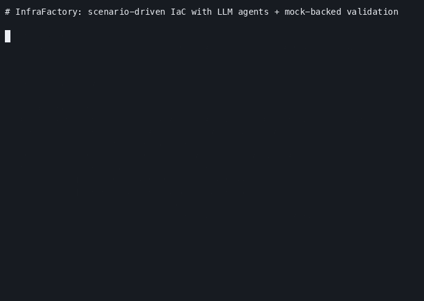
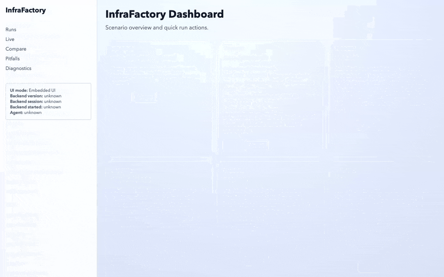

# InfraFactory

[](https://github.com/redscaresu/infrafactory/actions/workflows/ci.yml)
[](LICENSE)
[](go.mod)

Scenario-driven OpenTofu generation and validation across **AWS**, **GCP**, and **Scaleway** — generated by an LLM, validated against deterministic mock servers in seconds, optionally deployed against real cloud APIs.

## Why this exists

Hand-iterating IaC against real cloud APIs is slow, expensive, and flaky. LLMs are good at writing terraform but bad at debugging "why didn't this apply" — the error messages are layers deep and the feedback loop is 90 seconds per attempt against a real cloud.

InfraFactory closes that loop. You write a scenario YAML declaring intent (resources + acceptance criteria). The pipeline generates HCL with an LLM, validates it through four layers (static → mock-deploy → real-deploy → destruction), and feeds structured failures back into the next iteration's prompt. Subsecond mock validation, no cloud credentials required.

## Demo

### CLI



`infrafactory run scenarios/training/gcp-pubsub.yaml` against `fakegcp`: scenario YAML → 3-phase LLM generation → 3-layer validation → AI's first iteration fails (fakegcp rejects `google_project_service`) → feedback fed into the next iteration's prompt → second iteration converges to `Status: success`. Demonstrates the feedback loop that makes the pipeline robust against partial mock coverage. Re-record with `./docs/demo/record.sh` (requires `make mocks-up` + an LLM credential in env).

### Web UI — live run


Actually runs `gcp-pubsub` through the UI: scenario page → click Run → Live page populates with iteration stages live as the AI tries to build the topic + subscription against fakegcp → iteration 1 fails (fakegcp doesn't model `google_project_service` yet) → AI sees the feedback in iteration 2's prompt and converges → success banner → per-run IaC viewer shows the converged HCL with auto-injected `*_custom_endpoint` overrides pointing at fakegcp. ~2min end-to-end, 2 LLM iterations. Re-record with `make demo-ui-run` (needs `make mocks-up` + Claude CLI authenticated).

### Web UI — tour



Browser walkthrough of `full-stack-paris` (the most resource-dense scenario) — no `infrafactory run`, just a tour of the Scenario / Runs / Compare / Pitfalls / Diagnostics pages so viewers see the UI surface (24s, no LLM credit needed). Re-record with `make demo-ui`.

## Quickstart — 60-second demo

Three commands gets you a working LLM-driven infra pipeline against
local mock servers, validates a real terraform scenario end-to-end,
and tears everything down cleanly. **No cloud credentials. No real
cloud calls. ~60 seconds.**

```bash
# 1. Clone the four repos side-by-side (sibling layout).
mkdir -p ~/dev && cd ~/dev
for repo in infrafactory fakeaws fakegcp mockway; do
  git clone https://github.com/redscaresu/$repo.git
done
cd infrafactory

# 2. Bring up the full stack — mockway + fakegcp + fakeaws +
#    SeaweedFS (S3) + the SvelteKit UI — in one command, backgrounded.
make up

# 3. Run the fastest scenario end-to-end (~30s, 1 iteration).
./bin/infrafactory run scenarios/training/block-paris.yaml --config infrafactory.yaml

# 4. (Optional) point a browser at http://127.0.0.1:4173 to see the
#    same scenario in the UI with per-iteration stage breakdown.

# 5. Tear it all down.
make down
```

You should see `Status: success` and `run/terminal_reason: pass (target_reached)`
after step 3. The LLM generated a Scaleway Block Storage volume in HCL,
the static validator + mockway apply + topology test + destroy/orphan-check
all passed. The default `run` tears the resources down at the end of the
test cycle (the scenario's `destruction: no_orphans` acceptance criterion),
so `http://127.0.0.1:8080/mock/state` reports empty collections. To inspect
the post-apply state, add `--no-destroy` to the run command.

Use `make status` at any time to see which of the six ports
(`8080`, `8081`, `8082`, `9090`, `9091`, `4173`) are listening.

### Prerequisites

- Go 1.25+
- OpenTofu (https://opentofu.org) on PATH
- Docker (for the SeaweedFS S3 backend used by AWS scenarios) — only
  needed when running AWS-cloud scenarios; Scaleway-only and GCP-only
  demos don't require it
- An LLM credential, see below

### LLM provider

InfraFactory drives generation through the Claude CLI by default —
sign in with `claude login` once and it works out of the box. To use
a different model via OpenRouter instead, export `OPENROUTER_API_KEY`
and set `agent.type: openrouter` in `infrafactory.yaml`. Both paths
hit the same 3-phase generation pipeline (`plan → write HCL →
self-review`); pick whichever fits your budget/latency profile.

### What's running

| Port | Service | Why |
|---|---|---|
| 8080 | mockway | Scaleway HTTP API mock |
| 8081 | fakegcp | GCP API mock |
| 8082 | fakeaws | AWS API mock |
| 8083 | fakegenesys | Genesys Cloud CCaaS mock |
| 9090 | SeaweedFS | S3-compatible backend (Docker; AWS-only scenarios) |
| 9091 | s3router (S80) | HTTP shim that fans S3 traffic across SeaweedFS (data plane) and fakeaws (`?publicAccessBlock` subresource SeaweedFS doesn't model). `infrafactory.yaml` `s3.url` points here, not directly at SeaweedFS. See `cmd/s3router/`. |
| 4173 | infrafactory UI | SvelteKit dashboard + scenario runner |

### Other scenarios

After `make up`, any of these run against the same stack:

```bash
./bin/infrafactory run scenarios/training/gcp-full-stack.yaml          # cloud: gcp      → fakegcp
./bin/infrafactory run scenarios/training/aws-full-stack.yaml          # cloud: aws      → fakeaws
./bin/infrafactory run scenarios/training/full-stack-paris.yaml        # cloud: scaleway → mockway
./bin/infrafactory run scenarios/training/genesys-full-stack.yaml      # cloud: genesys  → fakegenesys
```

There are 44 scenarios under `scenarios/training/` (39 existing + 5 genesys from the S108-S115 arc). Inspect generated
HCL at `output/<scenario>/` (overwritten each run) and immutable
per-run artifacts at `.infrafactory/runs/<scenario>/<run-id>/`.

A successful run ends with `Status: success` and `run/terminal_reason: pass (target_reached)`. If a validation layer fails, the failure JSON feeds into the next iteration's LLM prompt and the loop retries (default budget: 5 iterations).

## Web UI

`make up` already started the UI on `http://127.0.0.1:4173`. If you'd
rather start just the UI (without the mocks), use `make run`.

The UI provides a scenario browser (edit YAML, see real-time validation), run controls (`--clean` / `--no-destroy` / Layer-3 toggles), a live page with per-iteration timer and stage indicators, per-run IaC viewer with diffs, and a pitfalls editor. See the UI demo above for the `full-stack-paris` walkthrough.

## How it works

```
scenario YAML  ──▶  3-phase LLM generation  ──▶  3-layer validation  ──▶  retry on failure
   (intent)         plan → write HCL → review     static / mock / real     (5x budget)
```

**Three-phase generation** (`prompts/{aws,gcp,scaleway}/phase{1,2,3}*.md`):
1. **Plan architecture** — scenario YAML + T-shirt size mappings → JSON architecture plan
2. **Generate HCL** — architecture + cloud-specific pitfalls + provider schema → OpenTofu `.tf` files
3. **Self-review** — generated HCL → 10-point checklist → corrections or `NO ISSUES FOUND`

**Three-layer validation** (each gates the next):
1. **Static** — `tofu init/validate/plan` + OPA `deny` policies on the plan JSON
2. **Mock deploy** — `tofu apply` against the matching mock; topology checks against `/mock/state`; OPA `deny_state` policies; mock-enforced FK integrity
3. **Real deploy** (optional, gated by `validation.layers.sandbox_deploy.enabled`) — `tofu apply` against the real cloud with auto-destroy on failure

On failure, the structured failure (`layer`, `stage`, `check`, `detail`, `failure_class`) is appended to the next iteration's prompt as a `<feedback>` block so the LLM sees what specifically broke.

**Auto-learning loop**: when an iteration self-corrects (iter N+1 succeeds after iter N failed) OR a run terminates with `stuck`/`repair_budget_exhausted`, the failure detail is extracted into `pitfalls/<cloud>.yaml` so future runs of any scenario in that cloud see the lesson up front. The descriptive fallback emits `source: descriptive` — the system seeds itself from real runs and a CI ratchet (`TestPitfallsNoHumanSeeding`) rejects hand-authored entries.

When a run reaches `target_reached` AFTER ≥1 failing iteration, two diff-based extractors run: one emits `source: fix` (the HCL snippet the LLM added to clear the failure), the other emits `source: avoid` (an attribute or block the LLM removed). Both are prescriptive guidance derived from real runs, not hand-written. This unblocked the "prompt-collapse" effort: prescriptive rules in the phase-2 prompts retired as the system's learned pitfalls replaced them. See [`docs/auto-learning-loop.md`](docs/auto-learning-loop.md) for the full architecture; `ADR-0012` and `ADR-0018` carry the original contracts.

## Cloud coverage

Each cloud has the same set of extension points; the scenario's `cloud:` field drives every dispatch.

| Extension point | AWS | GCP | Scaleway |
|---|---|---|---|
| Mock server | [`fakeaws`](https://github.com/redscaresu/fakeaws) (`:8082`) + [SeaweedFS](https://github.com/seaweedfs/seaweedfs) for S3 (`:9090`) | [`fakegcp`](https://github.com/redscaresu/fakegcp) (`:8081`) | [`mockway`](https://github.com/redscaresu/mockway) (`:8080`) |
| Provider pin | `hashicorp/aws ~> 5.70` | `hashicorp/google >= 5.0` (v5 for IAM SA) | `scaleway/scaleway >= 2.50` |
| Prompts | `prompts/aws/` | `prompts/gcp/` | `prompts/scaleway/` |
| Pitfalls | `pitfalls/aws.yaml` | `pitfalls/gcp.yaml` | `pitfalls/scaleway.yaml` |
| OPA policies | `policies/aws/` | `policies/gcp/` | `policies/scaleway/` |
| Training scenarios | `scenarios/training/aws-*.yaml` | `scenarios/training/gcp-*.yaml` | `scenarios/training/*-paris.yaml` |
| Full-stack example | `aws-full-stack.yaml` | `gcp-full-stack.yaml` | `full-stack-paris.yaml` |

Each first-party mock is wire-shape compatible with the matching real provider, enforced by an `examples/working/<svc>` smoke harness in the mock's own repo (`apply → plan -detailed-exitcode 0 → destroy`). See each mock's README for the API-compatibility contract.

AWS S3 is the exception: bucket sub-resource reads (GetBucketPolicy / GetBucketTagging / etc.) are served by SeaweedFS instead of fakeaws's stripped-down S3 handler — `terraform-provider-aws`'s bucket Read flow needs the full management surface. SeaweedFS doesn't model `?publicAccessBlock`, so a small reverse-proxy shim (`cmd/s3router/`, S80) fronts both backends: it routes `?publicAccessBlock` to fakeaws and fans `PUT/DELETE /<bucket>` to both so the bucket exists in both stores. Rationale + the SeaweedFS-vs-Adobe-S3Mock-vs-Garage-vs-LocalStack evaluation is documented in [`CONCEPT.md`](CONCEPT.md) under "Third-Party Mock Integration".

Adding a new cloud requires: prompt templates, pitfalls file, topology derivation rules, mock server, OPA policies, and training scenarios. Dispatch is driven by `cloudMockStateRouter`, `cloudConstraintPolicies`, `filterPolicyPathsByCloud`, `ExtractProviderSchemaForCloud`, and `detectCloud`.

## Commands

| Command | Purpose |
|---|---|
| `infrafactory init --path <file>` | Scaffold a new scenario YAML |
| `infrafactory validate <scenario>` | Layer 1 static checks only |
| `infrafactory generate <scenario>` | 3-phase LLM generation only |
| `infrafactory test <scenario>` | Layers 1-4 (no retry loop) |
| `infrafactory run <scenario>` | Full pipeline with retry loop + holdouts |
| `infrafactory mock start/stop/status/logs` | Manage the Mockway (Scaleway) mock only. Use `make mocks-up`/`-down`/`-status`/`-logs` to manage all three (mockway/fakegcp/fakeaws). |
| `infrafactory mock reset` | Reset state across every configured mock backend (mockway + fakegcp + fakeaws + s3 cascade in one call). Use this between scenarios in sweep harnesses instead of bare `curl` to `/mock/reset` — only this path cascades to the SeaweedFS s3 backend. |
| `infrafactory ui` | Serve the web dashboard |

Auxiliary binary (`bin/extract-pitfall`, built by `make build`) drives
the fix + avoid pitfall extractors against a recorded run directory
and emits a candidate `pitfalls/<cloud>.yaml` snippet on stdout —
used by the prompt-rule retirement protocol's step 2 when the organic
learning loop hasn't fired for the target pattern. See
[`docs/auto-learning-loop.md`](docs/auto-learning-loop.md),
`docs/decisions/0012-dynamic-pitfalls.md`, and
`docs/decisions/0018-n11-retirement-criteria.md` for the
auto-learning architecture.

Key flags for `run`: `--clean` (fresh start), `--no-destroy` (keep resources for incremental follow-up), `--repair-iterations-max N` (retry budget, default 5).

## Acceptance criteria

Scenario YAML declares criteria that gate run success:

| Type | Layer 2 (mock) | Layer 3 (real) |
|---|---|---|
| `connectivity` | Topology graph query | TCP connect with retry |
| `http_probe` | Topology graph query | HTTP GET, expect 2xx/3xx |
| `dns_resolution` | Auto-pass (informational) | DNS A/AAAA lookup with retry |
| `policy` | OPA rules on plan + state | Same |
| `destruction` | Orphan check after destroy | Same + real destroy |

## Repository layout

```
infrafactory/
├── cmd/infrafactory/      CLI + embedded UI build
├── internal/
│   ├── cli/               command tree, runtime wiring
│   ├── config/            infrafactory.yaml loader
│   ├── scenario/          YAML loader + JSON schema validation
│   ├── generator/         3-phase LLM pipeline (Claude / OpenRouter)
│   ├── harness/           static/mock/destroy primitives + provider schema extraction
│   ├── feedback/          failure-signature modelling, stuck detection
│   ├── runstore/          .infrafactory/runs persistence
│   └── e2e/               cross-repo end-to-end tests
├── ui/                    SvelteKit dashboard
├── scenarios/training/    per-cloud training scenarios
├── prompts/{aws,gcp,scaleway}/  phase 1-3 prompt templates
├── pitfalls/{aws,gcp,scaleway}.yaml  static + learned pitfalls
├── policies/{aws,gcp,scaleway}/  OPA rego files
├── scenario.schema.json   scenario contract
└── infrafactory.yaml      runtime config contract
```

## Development

Pre-commit hook runs gitleaks + `make test` (Go unit + UI unit + Playwright e2e). Wire it once:
```bash
make install-hooks
```

Common targets:
```bash
make test                  # full suite
make test-unit             # Go only
make ui-test-e2e           # Playwright only

# go-run mock path (foreground subprocesses; quick iteration on mock code):
make mocks-up              # start mockway + fakegcp + fakeaws (+ SeaweedFS via Docker)
make mocks-down            # stop them all
make mocks-status          # show port + PID for each (probes lsof, not just pidfiles)
make mocks-restart         # mocks-down + mocks-up; picks up sibling-repo source changes
make mockway-restart       # restart just one mock (also: fakegcp-restart, fakeaws-restart)

# container mock path (alternative — needs Docker, no Go install required;
# wires identical ports 8080/8081/8082 so scenarios + infrafactory.yaml
# don't care which path is active):
make mocks-up-containers   # build + start fakeaws + fakegcp + mockway
make mocks-down-containers
make mocks-pull            # refresh published GHCR images

# canonical sustain-ratchet sweep. Drives `infrafactory run` across
# every scenario under scenarios/training/ with `infrafactory mock reset`
# between scenarios. Output lands in /tmp/sweep-N/summary.tsv. Discards
# pitfall additions (sweep noise); preserves `avoid` entries via
# bin/pitfall-merge. Renames `make sweep-39` → `make sweep-N` when a new
# cloud lands; current N = 39.
make sweep-39

# session-close hygiene — sweeps lingering sweep scripts, log tails,
# and stray mock test binaries (compiled to /tmp/ by `go test`) on
# non-canonical ports. Safe to run any time; idempotent.
make clean-bg
```

When working on a sibling mock repo (`../fakegcp`, `../fakeaws`,
`../mockway`), `make mocks-up` spins up those mocks via `go run`
which compiles ONCE at boot. After committing a change in the
sibling repo, run `make <mock>-restart` (e.g. `make fakegcp-restart`)
to pick up the new source — otherwise the running mock keeps
serving the stale binary, a footgun that's wasted several debugging
sessions worth of time.

Gated e2e tests (cross-repo, require `tofu` + the sibling mock repos checked out):
```bash
INFRAFACTORY_ENABLE_E2E=1 go test ./internal/e2e/...
```

## Documentation

- [`docs/architecture.md`](docs/architecture.md) — component overview and validation-layer details
- [`docs/auto-learning-loop.md`](docs/auto-learning-loop.md) — deep-dive on the mock-server-bug classifier + fix/avoid extractors + diff-pattern templates, the ratchets, the sweep-time protocol, and a worked example
- [`docs/decisions/`](docs/decisions/) — ADRs (dynamic pitfalls, topology derivation, etc.)
- [`docs/scenario-failure-matrix.md`](docs/scenario-failure-matrix.md) — per-scenario pass/fail snapshot + failure classification
- [`AGENTS.md`](AGENTS.md) — entry point for AI agents working on this repo
- [`CONTRIBUTING.md`](CONTRIBUTING.md) — code conventions, PR contract, quality gates
- [`SECURITY.md`](SECURITY.md) — disclosure policy
- [`CHANGELOG.md`](CHANGELOG.md)

## License

Apache 2.0 — see [LICENSE](LICENSE).
