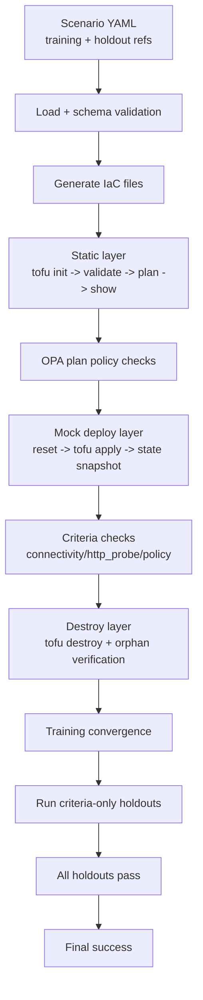
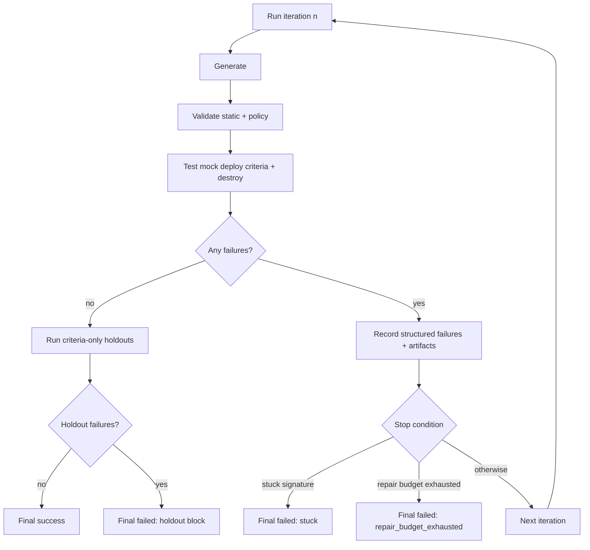

# InfraFactory

Scenario-driven infrastructure generation and validation for Scaleway with OpenTofu.

## Problem It Solves

Teams often face the same infrastructure pain points:
- Infrastructure intent is documented in prose, but implementation is in hand-written IaC.
- Validation is inconsistent and manual (or only static linting).
- Failed iterations are hard to diagnose and repeat.

InfraFactory addresses this by making infrastructure delivery scenario-driven and deterministic:
1. Define intent in scenario YAML.
2. Validate contracts up front (config + schema).
3. Generate and validate infrastructure through layered checks.
4. Persist artifacts and structured failures for repeatable iteration.

## New Here

If you are onboarding to this repo, use this order:
1. Run `go run ./cmd/infrafactory --help` once to see the command contract.
2. Read `internal/cli/root.go` to see command entrypoints.
3. Read `internal/cli/runtime.go` to understand shared runtime setup and dependency injection.
4. Read one command end-to-end (`internal/cli/generate_command.go`), then compare with `validate`, `test`, and `run`.
5. Read package contracts in this order: `internal/config`, `internal/scenario`, `internal/generator`, `internal/harness`, `internal/feedback`, `internal/runstore`.

First 10-minute code walk:
1. `go test ./internal/cli -run TestGenerateCommandWritesFilesDeterministically`
2. `go test ./internal/scenario -run TestLoadWithSchemaPaths`
3. `go test ./internal/harness -run TestStaticHarness`

This gives one quick pass across command orchestration, input contracts, and harness execution.

## Mental Model

Think in three layers:
1. Contracts: config/scenario parsing and validation up front.
2. Execution primitives: generator/harness packages return deterministic typed results.
3. Orchestration: CLI commands compose primitives and map errors/output to a stable CLI contract.

Single-command lifecycle (`generate`, simplified):
1. `internal/cli` builds runtime (config + dependencies + loaders).
2. Scenario is loaded and validated (`internal/scenario` + `scenario.schema.json`).
3. Generator returns files as data (`internal/generator`), not filesystem side effects.
4. CLI writes files deterministically and renders command output.

## Architecture


High-level flow:
1. Validate config and scenario contracts.
2. Generate OpenTofu files via three-phase LLM pipeline (plan → generate → self-review).
3. Run static checks (`tofu init/validate/plan/show`).
4. Run deploy-layer checks (apply, topology, state policy).
5. Run destroy and orphan verification.
6. Persist run artifacts and iterate based on structured feedback.

### Three-Phase Generation Pipeline

Generation runs three sequential LLM phases, each with a specialized prompt template in `prompts/`:

1. **Phase 1 — Plan Architecture** (`phase1_plan_architecture.md`):
   - Input: scenario YAML, resolved size mappings from `mappings.yaml`, constraints, prescriptive overrides.
   - Output: JSON architecture plan with concrete Scaleway resource types, dependency graph, and exact offerings.
   - The prompt enforces that sizes map to exact Scaleway types from the mappings table (e.g. compute large → `GP1-S`, not invented types like `GP1-L`).
   - Overrides from the scenario take priority over size mappings.

2. **Phase 2 — Generate HCL** (`phase2_generate_hcl.md`):
   - Input: architecture plan from phase 1, scenario YAML, constraints, acceptance criteria, provider resource schemas (when available), iteration feedback (when retrying).
   - Output: complete OpenTofu HCL files in `# File: <name>` block format.
   - Includes a **Scaleway Provider Pitfalls** section with 18 rules covering common LLM mistakes across K8s, Instance, Redis, LB, and RDB resources.
   - Enforces naming conventions, data source prohibition, variable defaults, and provider credential separation.

3. **Phase 3 — Self-Review** (`phase3_self_review.md`):
   - Input: generated HCL files from phase 2, scenario YAML, constraints, acceptance criteria, provider schemas (when available), iteration feedback.
   - Output: corrected `# File:` blocks for any files with issues, or `NO ISSUES FOUND` if clean.
   - Runs a 10-point review checklist: data sources, syntax, provider config, resources, dependencies, constraints, RDB/LB specifics, criteria compliance, naming, and best practices.
   - Corrected files are merged into the phase 2 output; uncorrected files are retained.

All three phases receive iteration feedback (`FeedbackJSON`) from prior failed iterations when running under `run`, enabling the LLM to learn from concrete validation/deploy/destroy failures.

## Process Flows

Note: static validation currently uses `tofu init/validate/plan/show` plus OPA policy checks; `tflint` is not part of the wired default pipeline.

Happy path (training + holdouts):



Failure and retry loop path:



## Validation Layers

1. Layer 1: Static
- Purpose: catch invalid IaC and policy violations early, before any deploy action.
- Runs `tofu init`, `tofu validate`, `tofu plan -out=tfplan`, `tofu show -json tfplan`
- Evaluates OPA policy checks on plan JSON (`deny`)

2. Layer 2: Mock Deploy (Mockway-backed)
- Purpose: verify deploy-time behavior and topology/policy expectations in a deterministic, low-cost environment.
- Resets mock state via mock client (`POST /mock/reset`)
- Runs `tofu apply -auto-approve`
- Pulls mock state snapshot (`GET /mock/state`)
- Runs topology checks on mock state
- Evaluates OPA state policies on mock state (`deny_state`)

3. Layer 3: Destroy Verification
- Purpose: ensure cleanup behavior is correct and no resources are left behind.
- Runs `tofu destroy -auto-approve`
- Pulls mock state snapshot and verifies no orphan resources remain

Supporting control loop:
- `run` command loop with failure-only retries (`repair_iterations_max`)
- first successful iteration ends training (`target_reached`)
- Stuck detection via failure-signature subset logic (`check`+`resource`+`detail`)
- Run/iteration artifact persistence under `.infrafactory/runs/...`

### Mockway API Coverage

Mockway is a companion SQLite-backed mock server that simulates Scaleway APIs for deterministic, offline testing. It covers:

| Service | Scaleway API | CRUD | Notes |
|---|---|---|---|
| Compute | Instance (servers, IPs, NICs, security groups, volumes) | Full | Server type catalog includes DEV1-S/M/L, GP1-XS/S/M/L/XL. Marketplace local images for ubuntu/debian/centos. |
| Networking | VPC, Private Network, Public Gateway | Full | Zone/region scoping. |
| Load Balancer | LB, Frontend, Backend, LB IP, LB Private Network | Full | Multi-backend support. Delete returns 409 when dependents exist (except LB private networks which cascade). |
| Database | RDB Instance, User, Database, ACL, Privilege, Certificate, Endpoint | Full | PostgreSQL + MySQL engines. Private network endpoints with IPAM. Delete returns 409 when dependents exist. |
| Kubernetes | K8s Cluster, Node Pool | Full | Cluster delete returns 409 when pools exist. DELETE returns resource with `"status": "deleting"` (required by SDK). |
| IAM | Application, API Key, Policy, Rule | Full | Application defaults applied. |
| Container Registry | Registry Namespace | Full | Public/private namespaces. |
| Redis | Redis Cluster | Full | Password, ACL rules, endpoints, settings. Required default fields populated. |
| Block Storage | Volume, Snapshot | Basic | Minimal CRUD. |

Key behaviors:
- Referential integrity: DELETE returns 409 Conflict when dependents exist (K8s pools, LB frontends/backends, RDB users/databases).
- All handlers use UUID IDs and RFC3339 timestamps.
- State inspection: `GET /mock/state` returns all resources; `POST /mock/reset` clears state.

### OPA Plan Policy Checks (Static Layer)

OPA policies are evaluated at two points using a rule naming convention:
- **`deny` rules**: evaluated against `tofu show -json tfplan` output during static validation (layer 1). Fires before any deploy action.
- **`deny_state` rules**: evaluated against the mockway state snapshot (`GET /mock/state`) during mock deploy validation (layer 2). Fires after apply.

A single `.rego` file can contain both rule types. For example, `no_public_database.rego` has a `deny` rule that checks the plan for missing `private_network` blocks and a `deny_state` rule that checks deployed state for public endpoints.

Bundled policy files:
- `policies/scaleway/no_public_database.rego` (plan + state)
- `policies/scaleway/no_public_endpoints.rego` (plan)
- `policies/scaleway/vpc_required.rego` (plan)
- `policies/scaleway/region_restriction.rego` (plan)
- `policies/scaleway/encryption_at_rest.rego` (plan)
- `policies/common/naming.rego` (plan)

Custom policies can be added to `policies/custom/` — any `.rego` file under `paths.policies` is automatically picked up.

This is separate from holdouts:
- OPA checks are part of the training validation stages within each run iteration.
- Holdouts are criteria-only scenarios executed after training convergence as a final gating phase.

## Current State

Core internal slices are implemented and tested:
- Config loading and validation (`internal/config`)
- Scenario parsing and JSON Schema validation (`internal/scenario`)
- Generator contracts, prompt rendering, and `# File:` parsing (`internal/generator`)
- Static, mock-deploy, and destroy harness primitives (`internal/harness`)
- Failure-signature and stuck detection helpers (`internal/feedback`)
- Filesystem run store (`internal/runstore`)

CLI command orchestration is now wired for:
- `init` scaffold generation
- `generate` pipeline adapter (runtime + scenario + generator write path)
- `validate` static harness + policy reporting
- `test` mock deploy + destroy verification flow
- `run` criteria-aware multi-iteration orchestration with convergence controls, holdout gating, and runstore persistence
- `mock` lifecycle wrappers (`start`/`stop`/`status`/`logs`)

Feature status snapshot:

| Area | Status | Notes |
|---|---|---|
| `init` scaffold | implemented | Writes deterministic schema-valid starter file. |
| `generate` runtime path | implemented with concrete transports | Runtime selects `claude-code` or `openrouter` adapters from config. |
| `validate` static layer | implemented | Runs `tofu init/validate/plan/show` + plan policy evaluation. |
| `test` mock deploy + destroy | implemented | Runs mock reset/apply/state checks and destruction verification flow. |
| `run` orchestration | implemented | Criteria-aware convergence and criteria-only holdout completion checks are wired. |
| `mock` command lifecycle | implemented | `mock start`/`stop`/`status`/`logs` are wired with deterministic output/error behavior. |
| sandbox/live deploy | implemented (Layer 3) | Optional real Scaleway deploy gated by Layer 2, using `terraform-live.tfstate`, real probes, and UI/API controls. |

Completed slices:
- Slices 1-17: core pipeline, CLI orchestration, generator transports, feedback-driven regeneration, logging, adaptive retry, issue remediation, and end-to-end pipeline stabilization.
- Slice 18 (`S18-T1`..`S18-T5`): expanded mockway coverage to all targeted Scaleway APIs — K8s standalone, IAM standalone, Container Registry, Redis, and Composite multi-service scenario. Extended `scenario.schema.json` with `kubernetes`, `iam`, `registry`, `redis` resource types (ADR-0007).
- Slice 19 (`S19-T1`): reliability review of all Slice 18 code — fixed referential integrity (delete returns 409 when dependents exist), LB/Frontend/Backend update persistence, IAM defaults, RDB certificate checks, and cross-LB data leaks.
- Slice 20 (`S20-T1`..`S20-T6`): scenario combination expansion — 6 new training scenarios exercising untested parameter combinations: MySQL engine + HA, large/xlarge compute sizes, multi-backend LB with TCP, private LB exposure, K8s/Redis/database overrides, public registry, selective IAM flags. Added prompt pitfalls for LB zone arguments, compute type mapping, and `assign_flexible_ipv6` conflicts. Expanded mockway server type catalog (GP1-L, GP1-XL, DEV1-L).
- All 12 training scenarios pass `infrafactory run` on first iteration.
- `S9-T8` (sandbox/live deploy) is implemented through Slices 26-29 under ADR-0010.

### Web UI Runtime Notes

- `infrafactory ui` serves the embedded frontend in normal builds and API-only mode under `-tags noui`.
- Run history lives under `/runs`; per-run IaC history lives under `/runs/<scenario>/<run_id>`.
- Scenario pages expose incremental controls (`--clean`, `--no-destroy`) plus a Layer 3 toggle with backend-reported credential readiness.
- Each run should write `run.json` immediately with `status: running` so the Live page can poll active state before terminal completion.
- Live pages show run mode, Layer 3 enablement, plan/baseline artifacts, Layer 3 stage progress, and real probe failures when present.
- Live logs use two sources:
  - primary: websocket stream at `/api/ws`
  - replay: per-run `app.log` from `GET /api/runs/{scenario}/{run_id}/log`
  - final fallback: synthesized console lines from polled run metadata and iteration artifacts when neither websocket frames nor log replay are available
- In Vite dev mode (`http://127.0.0.1:5173`), HTTP `/api` calls still proxy through Vite, but websocket logs connect directly to the backend origin (`ws://127.0.0.1:4173/api/ws` by default). Override with `VITE_UI_API_ORIGIN` if the backend runs on a different host/port.
- The backend explicitly allows local dev websocket origins (`127.0.0.1:*`, `localhost:*`) so this cross-origin browser connection succeeds in development.
- The backend websocket connection is long-lived after upgrade; it is no longer tied to the short-lived HTTP request context.
- When `agent.type=claude-code`, the UI run path resolves `agent.claude.command` once during preflight and uses that absolute binary path for the async run. This avoids “works in shell, not in UI run” drift caused by later `PATH` differences.
- The repo config currently pins `agent.claude.command` to `/opt/homebrew/bin/claude` on this machine to remove shell/PATH ambiguity during local UI runs.
- Run history tolerates incomplete historical run directories that do not contain `run.json`; they are skipped rather than breaking `/runs`.

### Web UI Dev Workflow

Terminal 1:
```bash
go run -tags noui ./cmd/infrafactory ui --addr 127.0.0.1:4173
```

Terminal 2:
```bash
cd ui
npm install
npm run dev
```

Open:
- UI dev server: `http://127.0.0.1:5173`
- Backend/API: `http://127.0.0.1:4173`

If the backend is not on `:4173`:
```bash
cd ui
VITE_UI_API_ORIGIN=http://127.0.0.1:4180 npm run dev
```

Required checks after Web UI changes:
```bash
go test -tags noui ./...
cd ui && npm test && npm run build
bash scripts/check_all.sh
```

If websocket log streaming still appears idle after a code change, restart both processes:
```bash
go run -tags noui ./cmd/infrafactory ui --addr 127.0.0.1:4173
cd ui && npm run dev
```

Notes on current runtime prerequisites:
- `generate` and `run` resolve a concrete transport-backed `SeedGenerator` from runtime (`internal/cli/runtime.go`) when no test/injected generator is provided.
- Runtime wiring path: `buildRuntime(...)` selects `NewClaudeSeedGenerator(...)` for `agent.type=claude-code` and `NewOpenRouterSeedGenerator(...)` for `agent.type=openrouter`.
- `openrouter` runtime path requires `OPENROUTER_API_KEY` at execution time; missing key surfaces deterministic `dependency_unavailable` failure output.
- `validate`/`test`/`run` expect generated OpenTofu files and tool/runtime dependencies (`tofu`, Mockway, and Docker for `mock` lifecycle commands).
- Sandbox/live deploy layer (Layer 3, real Scaleway) is implemented (see `docs/decisions/0010-layer3-real-scaleway-deploy.md`). Layer 2 (mockway) gates Layer 3. When enabled, real TCP/HTTP/DNS probes replace mock topology checks. Incremental runs snapshot mockway state before the first iteration and restore before each subsequent iteration. `test --no-destroy` skips post-test destruction to preserve state for incremental follow-up runs.

Criteria support status:
- `connectivity`: uses mock topology checks when Layer 3 is disabled, and real TCP probes when Layer 3 is enabled.
- `http_probe`: uses mock topology checks when Layer 3 is disabled, and real HTTP requests when Layer 3 is enabled.
- `policy`: fully functional. Evaluates OPA rules against plan JSON (layer 1) and mock state (layer 2). No network required.
- `destruction`: fully functional. Runs `tofu destroy` and verifies no orphan resources remain in mock state.
- `dns_resolution`: runs real DNS lookups when Layer 3 is enabled; otherwise it auto-passes with explicit informational output.

## Repository Layout

- `cmd/infrafactory/`: CLI entrypoint
- `internal/cli`: command tree and command-level wiring
- `internal/config`: runtime config model and loader (`infrafactory.yaml`)
- `internal/scenario`: scenario parsing and schema validation
- `internal/generator`: generator contracts, prompt rendering, output parser
- `internal/harness`: static/deploy/destroy orchestration primitives
- `internal/feedback`: failure models and stuck-detection helpers
- `internal/runstore`: `.infrafactory/runs` persistence implementation
- `scenario.schema.json`: scenario contract
- `infrafactory.yaml`: runtime config contract
- `policies/`: OPA policy files
- `prompts/`: LLM phase prompt templates (plan_architecture, generate_hcl, self_review)
- `mappings.yaml`: T-shirt size → Scaleway offering mappings (compute, database, kubernetes, redis)
- `scripts/`: quality gate helpers (`check_all.sh`, `check_doc_hygiene.sh`, `check_benchmarks.sh`, `full_flow.sh`)
- `scenarios/`: training/holdout/regression fixtures

Package ownership guide:
- `internal/cli`: args/flags, runtime wiring, command orchestration, output contract.
- `internal/config`: `infrafactory.yaml` defaults + typed validation errors.
- `internal/scenario`: scenario decode + schema validation + typed model.
- `internal/generator`: generator interfaces/errors, prompt rendering, output parsing.
- `internal/harness`: static/mock/destroy workflows and stage-level failures.
- `internal/feedback`: failure-signature modeling and stuck-detection utilities.
- `internal/runstore`: persisted run metadata and iteration artifacts.

## Requirements

- Go `1.24.6+`
- OpenTofu (`tofu`) available in `PATH`
- Docker + Docker Compose plugin (`docker compose`)
- `make`
- `curl` (used by smoke/dependency readiness helpers)
- Optional for deploy-layer integration: Mockway running locally

## Quick Start

```bash
go mod tidy
go test ./...
go run ./cmd/infrafactory --help
```

## Web UI

Serve the dashboard:

```bash
infrafactory ui --addr 127.0.0.1:4173
```

Build and run the single-binary UI bundle:

```bash
make build
./bin/infrafactory ui
```

Two-terminal development workflow:

```bash
# Terminal 1 (Go API server, no embedded assets required)
go run -tags noui ./cmd/infrafactory ui --addr 127.0.0.1:4173

# Terminal 2 (frontend dev server)
make ui-install
make ui-dev
```

Docker Compose dev workflow (single command stack):

```bash
make ui-stack-up
make ui-stack-logs
# stop when done
make ui-stack-down
```

Notes:
- Frontend dev proxy target is configurable via `UI_API_PROXY_URL` (default `http://127.0.0.1:4173`).
- `make ui-build` runs frontend build and syncs embedded assets into `cmd/infrafactory/ui/build` for Go `!noui` builds (`make build`).
- `make ui-stack-up` also builds a Linux backend binary for your host architecture and mounts it into the API container.

Important:
- For `agent.type=claude-code`, ensure `agent.claude.command` is installed and available in `PATH` (default: `claude`).
- For `agent.type=openrouter`, set `OPENROUTER_API_KEY` and configure `agent.openrouter.model`.

Useful UI routes:
- `/scenarios/<group>/<name>` shows the scenario editor, run-mode detection, and start-run controls.
- `/runs` shows global run history ordered by newest run first with filter controls.
- `/runs/<scenario>/<run-id>` shows the per-run IaC viewer with per-iteration snapshot selection, diff view, richer syntax-highlighted code preview, and download actions.
- `/live?scenario=<scenario>&run_id=<run-id>` shows live/log state for a specific run, including run mode, raw plan text, and baseline mock state when available.
- `/diagnostics` shows backend generator readiness checks (`claude-code` or `openrouter`).

Per-run IaC history:
- `output/<scenario>/` remains the mutable latest working output for a scenario.
- `.infrafactory/runs/<scenario>/<run-id>/generated/` is the immutable IaC snapshot for that specific run.
- `.infrafactory/runs/<scenario>/<run-id>/iterations/<n>/generated/` stores iteration-scoped IaC snapshots inside the run.
- `.infrafactory/runs/<scenario>/<run-id>/plan.txt` stores the static-layer plan text for that run.
- `.infrafactory/runs/<scenario>/<run-id>/baseline_state.json` stores the mockway baseline state detected before the run started.
- The UI run detail page reads both the final run-scoped snapshot and iteration-scoped snapshots, supports diffing between snapshots, and later runs do not overwrite historical IaC views.

Incremental UI workflow:
- The scenario page polls `GET /api/scenarios/<path>/run-mode` and shows whether the next run will be `clean` or `incremental`.
- `Run` supports the same incremental controls as the CLI:
  - `Keep state` sends `no_destroy: true`
  - `Force clean` sends `clean: true`
- The Live page shows the persisted run mode from `run.json` plus collapsible `Plan Diff` and `Baseline State` panels when those artifacts exist.

## Happy Path (Claude Code)

Run these commands from this repository root.

1. Start dependencies (Mockway).
```bash
make deps-up
```

2. Verify prerequisites.
```bash
tofu version
go run ./cmd/infrafactory --help
claude --version
```

3. Configure `infrafactory.yaml` for Claude transport:
- `agent.type: claude-code`
- `agent.claude.command: claude` (or full binary path)
- ensure the `claude` CLI is authenticated in your shell session

4. Run the full flow:
```bash
go run ./cmd/infrafactory generate scenarios/training/web-app-paris.yaml --config infrafactory.yaml --output human
go run ./cmd/infrafactory validate scenarios/training/web-app-paris.yaml --config infrafactory.yaml --output human
go run ./cmd/infrafactory test scenarios/training/web-app-paris.yaml --config infrafactory.yaml --output human
go run ./cmd/infrafactory run scenarios/training/web-app-paris.yaml --config infrafactory.yaml --repair-iterations-max 3 --output human
```

Optional capture mode for run diagnostics:
```bash
INFRAFACTORY_CAPTURE_LLM_RAW=1 go run ./cmd/infrafactory run scenarios/training/web-app-paris.yaml --config infrafactory.yaml --repair-iterations-max 3 --output human
```

Incremental workflow examples:
```bash
go run ./cmd/infrafactory run scenarios/training/web-app-paris.yaml --config infrafactory.yaml --repair-iterations-max 3 --no-destroy
go run ./cmd/infrafactory run scenarios/training/web-app-paris.yaml --config infrafactory.yaml --repair-iterations-max 3 --clean
```

5. Confirm artifacts:
- generated Terraform: `output/web-app-paris/`
- run artifacts: `.infrafactory/runs/web-app-paris/<run-id>/`
- run-scoped IaC history: `.infrafactory/runs/web-app-paris/<run-id>/generated/`

6. Cleanup:
```bash
make deps-down
```

## End-to-End Walkthrough

This is the shortest realistic path for a new contributor:

1. Create a scenario scaffold.
```bash
go run ./cmd/infrafactory init --path scenarios/training/new-scenario.yaml
```
2. Edit `scenarios/training/new-scenario.yaml` with real resources/criteria.
3. Generate files.
```bash
go run ./cmd/infrafactory generate scenarios/training/new-scenario.yaml --config infrafactory.yaml --output human
```
4. Validate static checks.
```bash
go run ./cmd/infrafactory validate scenarios/training/new-scenario.yaml --config infrafactory.yaml --output human
```
5. Run full orchestration loop.
```bash
go run ./cmd/infrafactory run scenarios/training/new-scenario.yaml --config infrafactory.yaml --repair-iterations-max 3 --output json
```
6. Inspect run artifacts.
```text
.infrafactory/runs/<scenario>/<run-id>/
```

Expected artifacts:
- `run.json` with run metadata/status and schema field (`infrafactory.run.metadata.v1`).
- `iterations/<n>/iteration.json` with stage/failure snapshots, deterministic `failure_summary` (when failures exist), and schema field (`infrafactory.run.iteration.v1`).
- `iterations/<n>/generated/` with immutable IaC snapshots for that specific iteration.
- `app.log` run-scoped structured application logs (`stderr` mirror + file sink for `run`).
- generated OpenTofu output under `output/<scenario>/` (latest mutable scenario output).
- generated OpenTofu history under `.infrafactory/runs/<scenario>/<run-id>/generated/` (immutable per-run snapshot used by the UI IaC viewer).
- downloadable UI archives:
  - `/api/runs/<scenario>/<run-id>/bundle.zip` for IaC-only history
  - `/api/runs/<scenario>/<run-id>/artifacts.zip` for the full run artifact directory
- optional LLM diagnostic artifacts when `INFRAFACTORY_CAPTURE_LLM_RAW=1`:
  - `iterations/<n>/llm_raw_<phase>.json` (raw model response per phase)
  - `iterations/<n>/llm_prompt_<phase>.json` (redacted/truncated prompt sent to model per phase)

Canonical run terminal reasons:
- `target_reached`
- `repair_budget_exhausted`
- `stuck`

Transport-dominated behavior (MVP):
- consecutive transport-runtime failures are bounded and can stop early with `check=transport_runtime_dominated`.
- per-iteration artifacts include `transport_diagnostics` when transport-runtime failures occur.

Retry semantics:
- retries only occur after failed iterations.
- successful iteration ends training immediately.

### Logging

Structured app logs are emitted as JSON lines with deterministic fields:
- `level`, `command`, `event`
- optional: `status`, `run_id`, `iteration`, `stage`, `check`, `detail`

Current sinks:
- `stderr` for all commands.
- run-scoped artifact file for `run`: `.infrafactory/runs/<scenario>/<run-id>/app.log`.

Secret-like detail tokens are redacted in log details (`token`, `api_key`, `secret`, `password`, `prompt`).

### Run Feedback Payload (MVP)

`run` passes structured failure feedback into next-iteration generation (`FeedbackJSON`) with:
- `layer`, `stage`, `check`, `command`, `detail`
- optional: `policy`, `resource`
- `failure_class`: `iac_validation`, `transport_runtime`, `orchestration_control`, `snapshot_failed`, `restore_failed`, `layer3_apply_failed`, `layer3_destroy_failed`, `probe_failed`, or `layer3_preflight_failed`

Terminal control markers are intentionally excluded from iterative repair feedback entries.

### Provider Schema Prompt Injection

`generate` and `run` lazily extract the Scaleway provider schema once per command runtime and inject it into phases 2 and 3:
- **Extraction**: `tofu init` + `tofu providers schema -json` in an isolated temp directory; cached for the runtime lifetime.
- **Timing**: on first generate call (not during generic runtime bootstrap), so `validate`/`test`/`mock` commands avoid the overhead.
- **Filtering**: phase 1 output identifies which Scaleway resource types are needed; `schema_filter.go` extracts only those types (plus companion sub-resources like `scaleway_k8s_pool` for `scaleway_k8s_cluster`) from the full provider schema. This keeps prompt size bounded.
- **Injection**: phases 2 and 3 both receive the filtered schema as an "Authoritative Reference" section. The prompt instructs the LLM to verify every attribute name and block type against the schema before using it.
- **Failure mode**: extraction failures are non-fatal; generation proceeds without schema injection. Look for `provider_schema skipped` in logs.

### Scaleway Provider Pitfalls

Phase 2 includes a curated pitfalls section that prevents the most common LLM-generated HCL errors. These are derived from iterative scenario runs across all 12 training scenarios:

| Resource | Pitfall |
|---|---|
| `scaleway_k8s_cluster` | Version/auto_upgrade consistency: patch version without auto_upgrade, minor version with auto_upgrade. Always set `delete_additional_resources = true`. |
| `scaleway_instance_server` | Use exact types from architecture plan (not invented types). No `routed_ip_enabled`. No inline `private_network` blocks — use separate `scaleway_instance_private_nic`. Use `ip_id = null` + `enable_dynamic_ip = false` for no public IP. Reference NIC private IPs, not server `private_ips`. |
| `scaleway_lb` | Use `ip_ids` list (not `ip_id`). No `assign_flexible_ip` or `assign_flexible_ipv6` when `ip_ids` is set. |
| `scaleway_lb_backend` / `scaleway_lb_frontend` | No `zone` argument — causes "Unsupported argument" error. |
| `scaleway_rdb_instance` | Valid `volume_type`: `lssd`, `sbs_5k`, `sbs_15k`. No `volume_size_in_gb` with `lssd`. Private network block needs `ip_net` or `enable_ipam = true`. |
| `scaleway_redis_cluster` | `password` required — variable must have a `default` value. |

Phase 1 also enforces exact size mapping usage to prevent the LLM from inventing Scaleway types that don't exist in the mock or real API.

### Size Mappings and Overrides

`mappings.yaml` maps T-shirt sizes to concrete Scaleway offerings:

| Resource | Sizes | Example Mapping |
|---|---|---|
| Compute | small/medium/large/xlarge | small → `DEV1-S`, large → `GP1-S`, xlarge → `GP1-M` |
| Database | small/medium/large/xlarge | small → `DB-DEV-S`, large → `DB-GP-XS` |
| Kubernetes | small/medium/large/xlarge | small → `DEV1-M` (1 node), medium → `GP1-XS` (3 nodes) |
| Redis | small/medium/large/xlarge | small → `RED1-MICRO`, xlarge → `RED1-L` |

Scenario-level overrides (e.g. `override: { node_type: DB-GP-XS, engine_version: "15" }`) take priority over size mappings and are passed to phase 1 as prescriptive instructions.

## Usage

### Exit Codes and Error Contract

CLI exit codes:
- `0`: success (`cli.ExitCodeSuccess`)
- `1`: runtime failure (`cli.ExitCodeRuntime`)
- `2`: usage/argument/flag contract failure (`cli.ExitCodeUsage`)

Error contract:
- Usage errors are surfaced as `*cli.CLIError` with code `usage` and map to exit code `2`.
- Runtime failures map to exit code `1`, with normalized error codes:
  - `config_invalid`
  - `scenario_malformed`
  - `scenario_invalid`
  - `dependency_unavailable`
  - `command_failed`
- Output mode contract is strict: `--output` must be `human` or `json`.
- Machine output schema version is `infrafactory.output.v1`.

### `infrafactory.yaml` Quick Reference

| Key | Required | Default | Purpose |
|---|---|---|---|
| `version` | yes | none | Config schema version (`"1.0"`). |
| `agent.type` | yes | none | Generator backend type (`claude-code` or `openrouter`). |
| `agent.repair_iterations_max` | no | `5` | Maximum failure-triggered retries in `run`. |
| `agent.phases` | no | `[plan_architecture, generate_hcl, self_review]` | Ordered generation phases (canonical sequence). |
| `agent.phase_delay_seconds` | no | `0` | Delay between generator phases (rate-limit mitigation). |
| `agent.claude.command` | no | `claude` | Executable used for `claude-code` transport. |
| `agent.claude.phase_timeout_seconds` | no | `300` | Hard timeout per Claude phase call; prevents indefinite hangs. |
| `agent.openrouter.model` | conditional | none | Required when `agent.type=openrouter`. |
| `agent.openrouter.base_url` | no | `https://openrouter.ai/api/v1` | OpenRouter API base URL. |
| `agent.openrouter.timeout_seconds` | no | `60` | OpenRouter request timeout per phase. |
| `agent.openrouter.max_retries` | no | `2` | OpenRouter retry count for transient failures. |
| `mockway.url` | yes | none | Mockway base URL used by deploy/destroy layers. |
| `mockway.auto_reset` | no | `true` | Whether mock reset is expected before deploy checks. |
| `validation.layers.*.enabled` | no | varies | Enables/disables layer execution paths. `sandbox_deploy` defaults to `false`; set to `true` for Layer 3 real Scaleway deploy (ADR-0010). |
| `validation.real_probes.timeout_seconds` | no | `5` | Per-attempt timeout for Layer 3 TCP/HTTP/DNS probes. |
| `validation.real_probes.retries` | no | `6` | Retry budget for Layer 3 probes to tolerate startup and propagation delays. |
| `validation.real_probes.retry_delay_seconds` | no | `5` | Delay between Layer 3 probe attempts. |
| `scaleway.sandbox_project_id` | no | none | Scaleway project ID used for Layer 3 real deploy. Required when `sandbox_deploy.enabled=true`. |
| `paths.output` | no | `./output` | Generated IaC output root. |
| `paths.policies` | no | `./policies` | Policy root used by harness validation. |

Canonical config example: `infrafactory.yaml` in repo root.

### Scenario Authoring Quick Reference

Required top-level keys:
- `scenario`, `version`, `cloud`, `description`, `acceptance_criteria`

Available resource types (under `resources:`):
- `compute`: `purpose`, `size` (small/medium/large/xlarge), `count`, optional `override` (offer, image)
- `networking`: `vpc`, `private_network`, optional `load_balancer` (exposure: public/private, backends: port + protocol: http/https/tcp)
- `database`: `engine` (postgresql/mysql), `size`, `high_availability`, optional `override` (node_type, engine_version)
- `kubernetes`: `size`, optional `override` (node_type, node_count)
- `redis`: `purpose`, `size`, optional `override` (node_type)
- `registry`: `purpose`, `is_public`
- `iam`: `purpose`, `application`, `api_key`, `policy` (all default to true when omitted)

Common criteria patterns:
- `policy`: `type: policy`, `check: <constraint_name>`, `expect: pass|fail`
- `connectivity`: `from`, `to`, optional `port`, `expect: success|blocked`
- `http_probe`: `target`, `port`, `expect: reachable|unreachable`
- `destruction`: `expect: no_orphans`

Holdout-only routing fields:
- `type: holdout`
- `references: <training-scenario-path>`

Layer 3 note:
- `dns_resolution` requires Layer 3 to be enabled. Without Layer 3, it auto-passes with an informational support-matrix stage.

### Training Scenarios

12 training scenarios covering the full parameter space:

| Scenario | Resources | Key Coverage |
|---|---|---|
| `web-app-paris` | compute, networking (LB), database | PostgreSQL, small, public LB, policy checks |
| `k8s-cluster-paris` | kubernetes, networking | K8s small, VPC + private network |
| `iam-policies-paris` | iam | IAM application + API key + policy |
| `registry-paris` | registry | Private container registry |
| `redis-paris` | redis, networking | Redis small cache |
| `full-stack-paris` | all 7 resource types | Composite multi-service |
| `mysql-ha-paris` | compute, networking, database | MySQL engine, medium DB, HA=true |
| `compute-lb-multi-paris` | compute, networking (multi-backend LB) | Large compute (count=3), HTTP + TCP backends |
| `k8s-medium-override-paris` | kubernetes, networking | Medium K8s, node_type/node_count overrides |
| `private-lb-db-paris` | compute, networking (private LB), database | Private LB, large PostgreSQL with overrides |
| `public-registry-iam-paris` | registry, iam | Public registry, IAM with policy=false |
| `redis-xlarge-session-paris` | compute, redis, networking | XLarge Redis with node_type override, xlarge compute |

### Basic setup and verification

```bash
go mod tidy
make test-all
```

### Developer Experience commands (`Makefile`)

Dependency lifecycle:

```bash
make deps-up
make deps-ps
make deps-logs
make deps-down
make deps-recreate
make deps-clean
```

Testing:

```bash
make test-unit
make test-all
make bench-check
```

CI behavior:
- Pull requests run `go test ./...`.
- Pushes to `main` run `go test ./...` and build/upload Linux binaries for `amd64` and `arm64`.

Real-tool smoke (opt-in):

```bash
make smoke-validate
MOCKWAY_URL=http://127.0.0.1:8080 make smoke-mockway
make smoke
make smoke-mockway-local MOCKWAY_BIN=/path/to/mockway
make smoke-mockway-manual
```

Transport adapter smoke tests (opt-in):

```bash
INFRAFACTORY_ENABLE_CLAUDE_TRANSPORT_SMOKE=1 \
go test ./internal/generator -run TestClaudeSeedGeneratorRealCommandSmoke

INFRAFACTORY_ENABLE_OPENROUTER_TRANSPORT_SMOKE=1 \
OPENROUTER_API_KEY=... \
OPENROUTER_MODEL=anthropic/claude-3.5-sonnet \
go test ./internal/generator -run TestOpenRouterSeedGeneratorRealHTTPOptInSmoke
```

Notes:
- `smoke-validate` runs `TestValidateCommandRealToolSmoke` with `INFRAFACTORY_ENABLE_REALTOOL_SMOKE=1`.
- `smoke-mockway` starts dependencies (`make deps-up`), waits for Mockway readiness, then runs `TestTestCommandRealToolMockwaySmoke` with `INFRAFACTORY_ENABLE_REALTOOL_MOCKWAY=1`.
- `smoke-mockway-local` runs the same smoke test against a locally installed `mockway` binary and auto-stops it after the test.
- `smoke-mockway-manual` runs the explicit fallback sequence (`docker run` + healthcheck + smoke test).
- Default test paths remain hermetic; smoke tests require external tools/services.
- Benchmark regression checks are env-gated and optional by default (`INFRAFACTORY_ENABLE_BENCHMARKS=1`).

Smoke test path options:
- Compose-managed dependency path: `make smoke-mockway`
- Local binary path (no Docker image required): `make smoke-mockway-local MOCKWAY_BIN=/path/to/mockway`
- Manual Docker fallback path: `make smoke-mockway-manual`

Troubleshooting:
- If Docker image pull fails with `denied`, use the local binary path (`smoke-mockway-local`) until image publishing is available.
- If you see `connection refused` to `localhost:8080`, use `127.0.0.1` explicitly and ensure Mockway is healthy:
  `curl -sSf http://127.0.0.1:8080/mock/state >/dev/null`.
- `smoke-mockway-local` may print one or more "waiting for mockway binary..." lines during startup; that is expected.
- If `generate` or `run` fails with `prompt render failed`, ensure `paths.prompts` points to a directory containing `phase1_plan_architecture.md`, `phase2_generate_hcl.md`, and `phase3_self_review.md`.
- If `generate` appears stuck on Claude transport, lower `agent.claude.phase_timeout_seconds` to fail faster and surface timeout errors while debugging.
- If `validate` or `test` fails with a generic `exit status 1`, rerun and inspect the surfaced `stderr:` tail in the failure detail; command stderr is now included directly in stage failure output.
- If you want iterative LLM correction from failures, use `run` (not just `generate` + `test`): `run` feeds prior iteration failures back into generation via `FeedbackJSON`.
- If you need to verify what failure feedback the model actually received, run with `INFRAFACTORY_CAPTURE_LLM_RAW=1` and inspect both `llm_prompt_<phase>.json` and `llm_raw_<phase>.json` for the same iteration.
- If generated `.tf` files contain markdown fences/tables, rerun `generate`; parser hardening strips fenced payloads and drops common markdown artifacts before file writes.
- `self_review` now applies partial corrections by merging returned `# File:` blocks into the existing generated file set; files omitted in self-review output are retained.
- `self_review` "no changes" detection now requires the exact canonical phrase `NO ISSUES FOUND` (case-insensitive, trimmed). Fuzzy substring matching (e.g. "looks good", "code is correct") has been removed to prevent false suppression of corrections. Unparseable self-review prose (no file blocks, not canonical phrase) falls through as a no-op, retaining phase-2 files.
- If `run` stops with `stuck`, compare failure detail strings across iteration artifacts (`iterations/<n>/iteration.json`): stuck signatures now include `check`, `resource`, and `detail`.
- If you see a `provider_schema skipped` log entry, schema extraction failed and generation continued without schema injection; verify `tofu` availability/network access if you expected schema-enriched prompts.
- If Claude output omits Scaleway provider wiring, `generate` now auto-injects `required_providers.scaleway` and `provider "scaleway"` into `providers.tf` before writing files.
- If `agent.type=openrouter` fails with `dependency_unavailable`, export `OPENROUTER_API_KEY` in the execution environment.
- If transport smoke tests fail, verify provider prerequisites:
  - claude transport smoke: `claude` command is installed and authenticated.
  - openrouter transport smoke: `OPENROUTER_API_KEY` and `OPENROUTER_MODEL` are set.

### Testing Matrix

| Goal | Command | External deps |
|---|---|---|
| Hermetic full test suite | `go test ./...` | none |
| Full local quality gate | `bash scripts/check_all.sh` | none |
| Unit-focused internal work | `make test-unit` | none |
| Repo-wide checks | `make test-all` | none |
| Benchmark guardrails (opt-in) | `make bench-check` | none |
| Real-tool static smoke | `make smoke-validate` | `tofu` |
| Real-tool mock deploy smoke | `make smoke-mockway` | `tofu`, Docker/Mockway |
| Real-tool mock smoke (local bin) | `make smoke-mockway-local MOCKWAY_BIN=/path/to/mockway` | `tofu`, local `mockway` |

Output contract regression guardrail:
- Golden snapshots for human/json output rendering are stored in:
  - `internal/cli/testdata/golden/output_contract/`
  - `internal/cli/testdata/golden/commands/`
- Refresh snapshots intentionally with `UPDATE_GOLDEN=1 go test ./internal/cli -run TestOutputContractGoldenSnapshots`.
- Refresh command-level snapshots with `UPDATE_GOLDEN=1 go test ./internal/cli -run TestCommandOutputGoldenSnapshots`.

Benchmark regression guardrail:
- Run `make bench-check` to execute benchmark thresholds in `scripts/check_benchmarks.sh`.
- Override thresholds with env vars:
  - `INFRAFACTORY_BENCH_MAX_NS_OUTPUT_JSON`
  - `INFRAFACTORY_BENCH_MAX_NS_OUTPUT_HUMAN`
  - `INFRAFACTORY_BENCH_MAX_NS_RUNSTORE_RW`

### Practical example 1: Inspect available CLI commands and flags

```bash
go run ./cmd/infrafactory --help
```

Command tree currently exposed:
- `init [--path <scenario-path>]`
- `generate <scenario-path>`
- `validate <scenario-path>`
- `test <scenario-path> [--no-destroy]`
- `run <scenario-path> [--repair-iterations-max N] [--clean] [--no-destroy]`
- `mock start`
- `mock stop`
- `mock status`
- `mock logs`
- `ui [--addr <host:port>]`

Global flags:
- `--config` (default `./infrafactory.yaml`)
- `--output` (`human` or `json`)

### Practical example 2: Initialize a scenario scaffold

```bash
go run ./cmd/infrafactory init --path scenarios/training/new-scenario.yaml
```

This writes a minimal schema-valid scaffold and prints deterministic next-step commands.

### Practical example 3: Run command adapters with explicit scenario path

```bash
go run ./cmd/infrafactory generate scenarios/training/web-app-paris.yaml --config infrafactory.yaml --output human
go run ./cmd/infrafactory validate scenarios/training/web-app-paris.yaml --config infrafactory.yaml --output json
go run ./cmd/infrafactory test scenarios/training/web-app-paris.yaml --config infrafactory.yaml --output human
go run ./cmd/infrafactory run scenarios/training/web-app-paris.yaml --config infrafactory.yaml --repair-iterations-max 3 --output json
```

Incremental run behavior:
- `--clean` forces a fresh run and ignores any prior state signals.
- `--no-destroy` skips post-convergence destroy and holdout execution so mockway state and `terraform.tfstate` remain available for the next run.
- Without either flag, `run` auto-detects incremental mode only when mockway already has resources, `output/<scenario>/terraform.tfstate` exists, and the run store contains a previous successful run for the same scenario.

Incremental operator workflow:
1. Start from a baseline scenario such as `scenarios/training/incremental-project-paris.yaml`.
2. Run the first pass with `--no-destroy` so the mock account state and `terraform.tfstate` remain available:
   `go run ./cmd/infrafactory run scenarios/training/incremental-project-paris.yaml --config infrafactory.yaml --repair-iterations-max 3 --no-destroy`
3. Edit the same scenario file to add the next resource slice, then rerun with `--no-destroy`.
4. InfraFactory will report `run/mode: pass (incremental ...)` once the prior successful run, state file, and mockway resources all exist.
5. Use `--clean` when you want to discard the preserved baseline and force a fresh apply from the current scenario definition.
6. A normal run without `--no-destroy` still performs the final destroy; the next run will fall back to clean mode because the preserved baseline is gone.

### Practical example 4: Start Mockway via CLI wrapper

```bash
go run ./cmd/infrafactory mock start --config infrafactory.yaml
go run ./cmd/infrafactory mock status --config infrafactory.yaml
go run ./cmd/infrafactory mock logs --config infrafactory.yaml
go run ./cmd/infrafactory mock stop --config infrafactory.yaml
```

### Practical example 5: Run package-focused checks while developing

```bash
go test ./internal/config
go test ./internal/scenario
go test ./internal/generator
go test ./internal/harness
go test ./internal/feedback
go test ./internal/runstore
```

### Practical example 6: Run optional layer-2 integration smoke test

```bash
INFRAFACTORY_ENABLE_INTEGRATION=1 \
INFRAFACTORY_MOCKWAY_URL=http://127.0.0.1:8080 \
go test ./internal/harness -run TestLayer2IntegrationSmoke
```

### Practical example 7: Run optional CLI real-tool smoke tests directly

```bash
INFRAFACTORY_ENABLE_REALTOOL_SMOKE=1 \
go test ./internal/cli -run TestValidateCommandRealToolSmoke

INFRAFACTORY_ENABLE_REALTOOL_MOCKWAY=1 \
INFRAFACTORY_MOCKWAY_URL=http://127.0.0.1:8080 \
go test ./internal/cli -run TestTestCommandRealToolMockwaySmoke
```

Manual fallback sequence (equivalent to `make smoke-mockway-manual`):

```bash
docker run --rm -d --name infrafactory-mockway -p 8080:8080 ghcr.io/redscaresu/mockway
curl -sSf http://127.0.0.1:8080/mock/state >/dev/null
INFRAFACTORY_ENABLE_REALTOOL_MOCKWAY=1 INFRAFACTORY_MOCKWAY_URL=http://127.0.0.1:8080 go test ./internal/cli -run TestTestCommandRealToolMockwaySmoke
```

### Practical example 8: Inspect persisted run artifacts

```text
.infrafactory/runs/<scenario>/<run-id>/
```

You will find `run.json` metadata, per-iteration artifacts (for example `iterations/1/iteration.json`), and `app.log` structured command/run logs in that directory tree.

### Practical example 9: One-command full flow helper

```bash
./scripts/full_flow.sh
```

Optional overrides:
```bash
CAPTURE_LLM_RAW=1 REPAIR_MAX=3 OUTPUT_MODE=human ./scripts/full_flow.sh
```

This helper starts mock, runs `run`, prints key artifact paths, and stops mock automatically.

## Local Quality Checks

```bash
bash scripts/check_all.sh
```

## Documentation Index

- Architecture: `docs/architecture.md`
- Full concept log: `CONCEPT.md`
- Decisions (ADRs): `docs/decisions/`
- Contributor guide: `CONTRIBUTING.md`
- Agent workflow: `AGENTS.md`
- Session bootstrap: `SESSION_START.md`
- Ticket backlog: `BACKLOG.md`
- Current execution stub: `CURRENT_TICKET.md`
- Rolling status: `STATUS.md`
- Execution prompt: `docs/process/EXECUTION_PROMPT.md`

### Architecture Decision Records (ADRs)

| ADR | Title | Status |
|---|---|---|
| 0001 | Foundations — base stack and execution model | Accepted |
| 0002 | CLI Command Contract — frozen args/flags/exit-code contract | Accepted |
| 0003 | Permanent Sandbox/Live Deploy Block — governance non-goal | Accepted |
| 0004 | Generator Transport Contract — claude/openrouter selection and phase semantics | Accepted |
| 0005 | Dual Iteration Controls | Superseded by ADR-0006 |
| 0006 | Run Failure-Only Retry Control — single `repair_iterations_max` knob, stop on first success | Accepted |
| 0007 | Scenario Schema Resource Expansion — kubernetes, iam, registry, redis resource definitions | Accepted |

### Doc Hygiene Automation

`bash scripts/check_doc_hygiene.sh --staged` runs automatically as part of `check_all.sh` and enforces contributor governance:
- Code or config changes (`cmd/`, `internal/`, `prompts/`, `policies/`, `scenarios/`, `go.mod`, `scenario.schema.json`) require a `STATUS.md` update.
- CLI contract or schema changes (`cmd/infrafactory/`, `internal/cli/`, `scenario.schema.json`, `infrafactory.yaml`) require an ADR update in `docs/decisions/`.
- New ADR files require an update to `docs/decisions/README.md` index.

This ensures documentation stays in sync with code changes without manual enforcement.

## Agent Kickoff

For autonomous ticket execution in a fresh agent session, use:

```text
Use docs/process/EXECUTION_PROMPT.md exactly. Start now.
```

## License

Apache License 2.0. See `LICENSE`.
